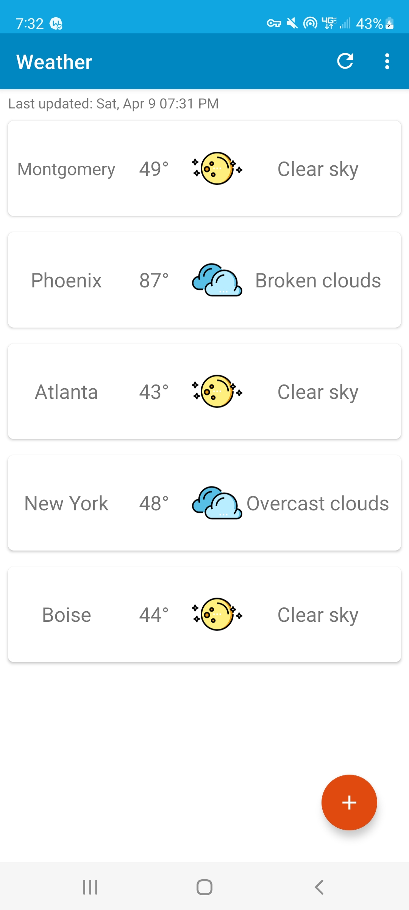
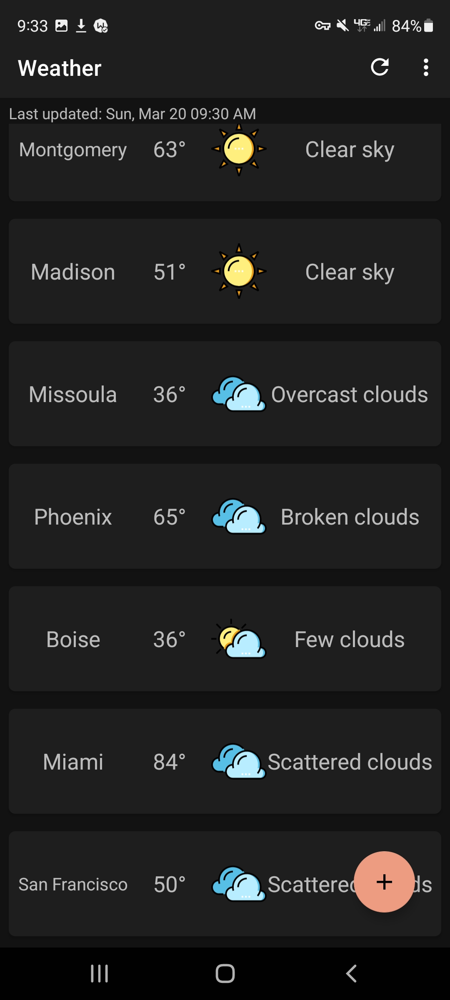
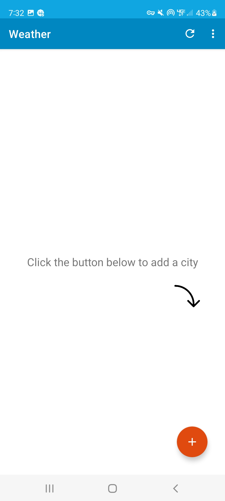
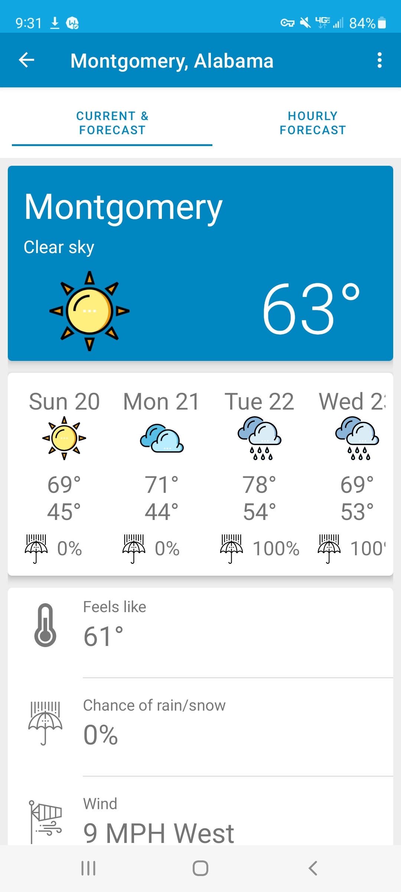
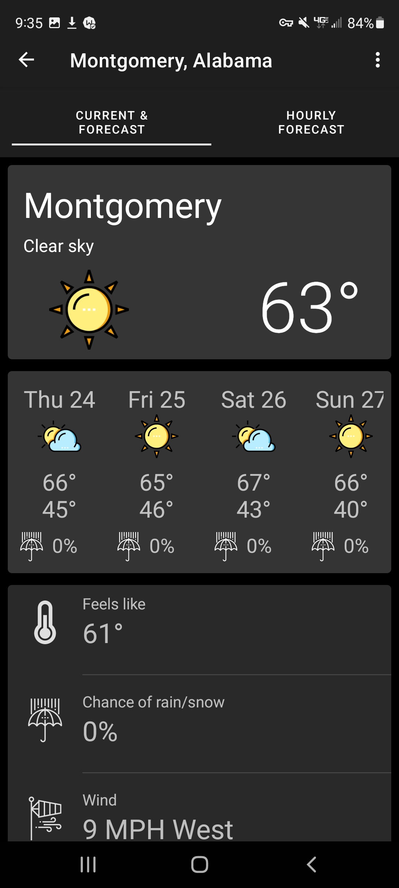
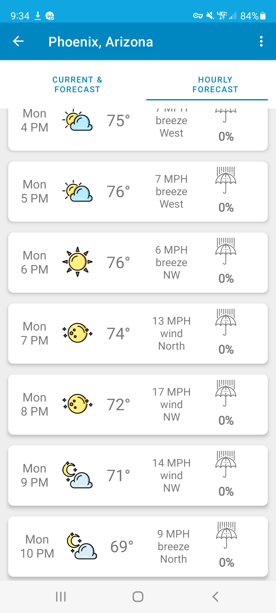
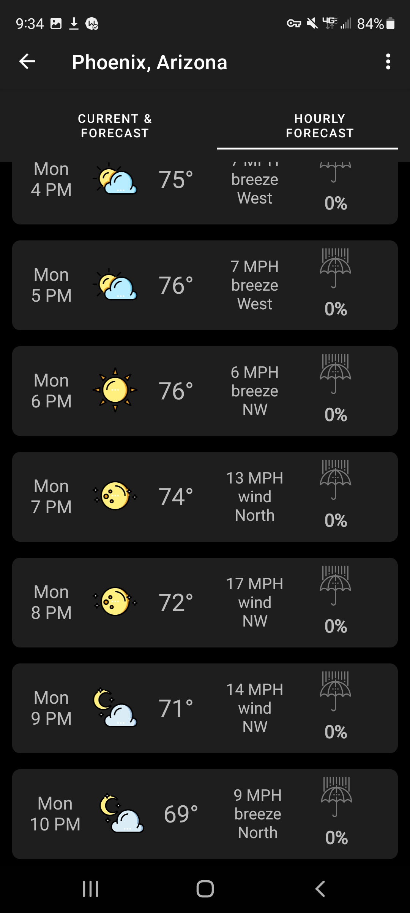
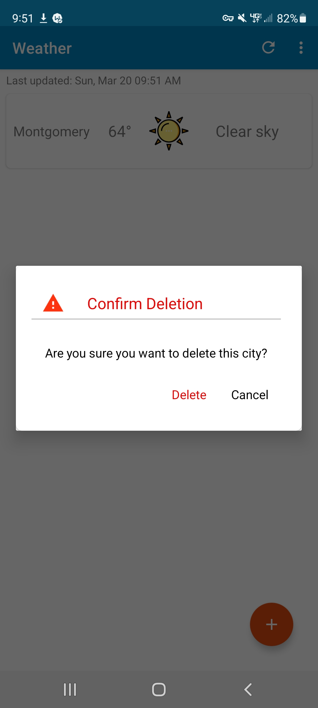

Weather is a weather application intended to allow checking the weather to be simple and enjoyable,
without ads and articles eating up all of your data.

This weather application was created to practice MVVM structure, API calls with Retrofit, 
basic database operations with Room, Kotlin coroutines, dependency injection with Dagger/Hilt,
and Navigation component. This is effectively my first attempt at using these components
in a real application, and not a sterile test environment

Icons designed by Freepik from Flaticon and edited by myself in Inkscape

I hope your weather checking is an enjoyable experience :)

- cseltz
<h2>Main weather list</h2>

<h2>Night mode</h2>

<h2>Initial app startup</h2>

<h2>Current weather and forecast</h2>

<h2>Night mode</h2>

<h2>Hourly forecast</h2>

<h2>Night mode</h2>

<h2>Custom delete dialog</h2>

